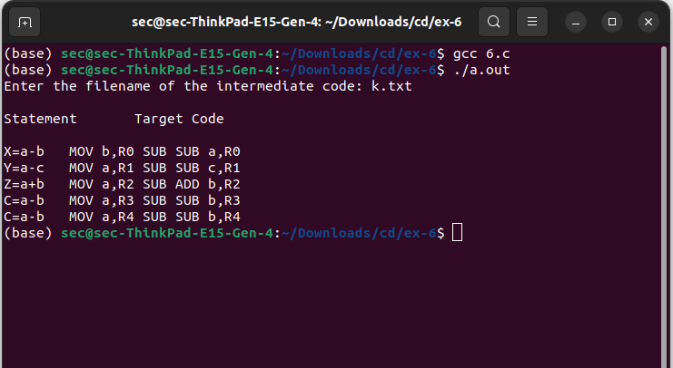

# Ex. No : 6	
# IMPLEMENTATION OF THE BACK END OF THE COMPILER 
## Register Number : 212222040101
## Date : 

## AIM   
To write a program to implement the back end of the compiler.

## ALGORITHM
1.	Start the program.
2.	Get the three variables from statements and stored in the text file k.txt.
3.	Compile the program and give the path of the source file.
4.	Execute the program.
5.	Target code for the given statement is produced.
6.	Stop the program.

## PROGRAM

```c
#include <stdio.h> 
#include <ctype.h>
#include <stdlib.h>

int main() {
int i = 2, j = 0, k = 2, k1 = 0; char ip[10], kk[10];
FILE *fp;

printf("Enter the filename of the intermediate code: "); scanf("%s", kk);

fp = fopen(kk, "r"); if (fp == NULL) {
printf("\nError in opening the file\n"); return 1;
}
printf("\nStatement\tTarget Code\n\n"); while (fscanf(fp, "%s", ip) != EOF) {
printf("%s\tMOV %c,R%d SUB ", ip, ip[i + k], j);

if (ip[i + 1] == '+')
printf("ADD "); else
printf("SUB ");


if (islower(ip[i])) printf("%c,R%d\n", ip[i + k1], j);
else
printf("%c,%c\n", ip[i], ip[i + 2]);

j++;
k1 = 2;
k = 0;
}

fclose(fp);
return 0;
}
```
## k.txt
```
X=a-b 
Y=a-c 
Z=a+b 
C=a-b 
C=a-b
```
## OUTPUT 



## RESULT
The back end of the compiler is implemented successfully, and the output is verified.
